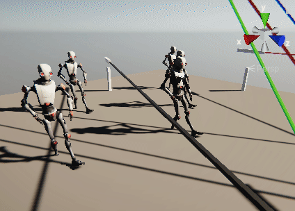
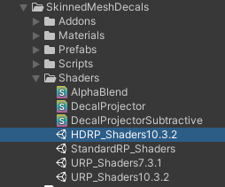
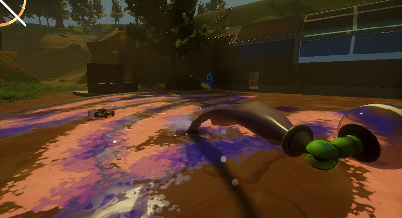
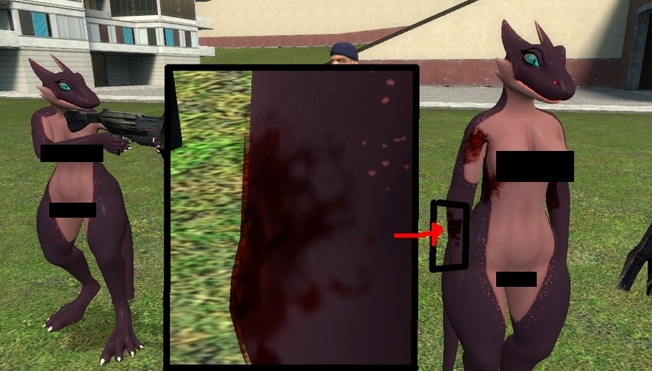
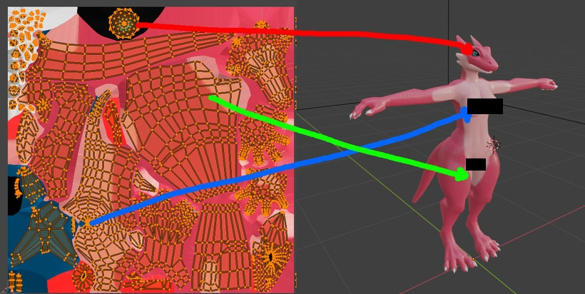
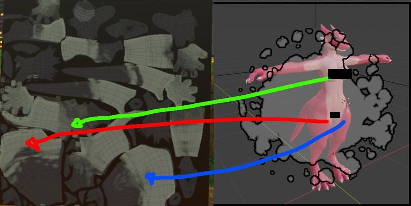
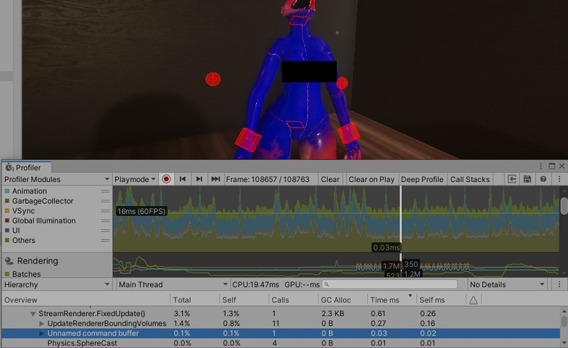
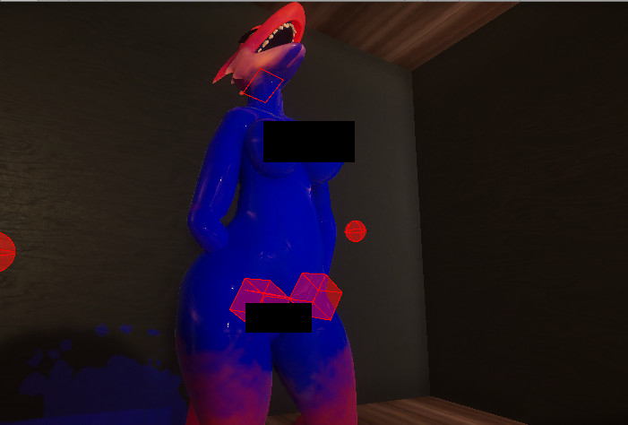

# Unity Skinned Mesh Renderer Decals

[](https://openupm.com/packages/com.naelstrof.skinnedmeshdecals/)

An example of how to create efficient projected decals on moving skinned meshes. This should work on all render pipelines, though HDRP is what this project is built on.



## Usage

1. Install the SkinnedMeshDecals package by adding `https://github.com/naelstrof/SkinnedMeshDecals.git#upm` through the Package Manager's "Add package from git URL". (Or use the openupm badge above.)
2. Install the relevant Shaders unity package based on which render system you're using.

3. Enable "Lightmap generation" in the target models' import settings, or ensure that models have atlased uv2s so that decals can be mapped to any part of the mesh.
4. Apply a material to the target model's mesh that has a `_DecalColorMap` input, and uses UV2 only for the `_DecalColorMap`. I use AmplifyShaderEditor to create the shaders for it, this is the only pipeline dependant part! You can also simply use one of the URP, HDRP, or Standard shader examples that are included in the package's Shaders folder.
5. Ensure your decal textures, the ones that you'll be splattering, each have mipmapping disabled, and have texture wrap set to clamped. **This is important!** Otherwise the decals will cover the whole model.
6. Create a script that calls `PaintDecal.instance.RenderDecal(...)` with the target being one of the renderers you've set up. It should let you draw decals!

## Installation

You can install this package either by adding by adding `https://github.com/naelstrof/SkinnedMeshDecals.git#upm` through the Package Manager's "Add package from git URL" or by using the openupm badge above.

## Details

This is going to be a technical description, I was surprised how little information online there is about rendering decals on a skinned mesh.

First off, I'm using HDRP, the fancy new render pipeline for Unity and it has built-in support for decals! These decals are hyper-efficient, though they are a very particular kind of decals commonly known as "screenspace" decals. They work fantastic for static decals on static meshes.

For example for splats on the ground they work great.



Unity's HDRP pipeline allows for literal thousands of these decals without much rendering cost, and it's super easy to implement! This is due to just letting the GPU do all the heavy lifting.

However if you try to render these decals on any non-static mesh...


It shifts around, and warps strangely. This won't work well for KoboldKare since fluids play a big part in the game.

Even Borderlands 3 suffers from this issue, good decals sometimes aren't a priority even in triple A FPS shooters!


I want to do a little better than that, but I also don't want to purchase Asset Store addons. So I had to do some research and thinking.

I recall Valve games having great decals, and wanted to dissect their technique-- here's an example.



You can see the decal is slightly floating off the mesh-- Source games actually copy and extrude the hit part of the mesh. This is an incredibly complex and frankly a brute-force way of adding deform-able decals to a character. 

It isn't a good fit for KoboldKare since it drastically limits the number of decals-- and is really prone to bugs and optimization issues.

Doing a bit of google-foo, I found a very good document done by Minion's Art on Patreon: https://www.patreon.com/posts/skinned-mesh-22015350 

This is it! Minion uses render textures to store decals on the character, and offloads all the decal projection calculations onto the GPU! This allows for technically "infinite" decals per-character, and just like the screen-space decals it offloads the majority of the work to the GPU.

There's a big problem though, Unity's Projectors don't work in HDRP! This prevents us from using any of the advice or code that Minion so graciously shared, but the strategy is sound-- and it shouldn't be that hard to replicate.

Minion's decal strategy basically goes like this:

* UV-unwrap a mesh to the screen with a shader, and also draw a decal to it.
* Render this mesh by itself into a RenderTexture, then blend it onto the character's cumulative RenderTexture.

Seems simple enough! Starting with the "projector" shader, I realized that it's basically the entire texture pipeline but in reverse. Here's what a normal shader typically computes.



It figures out which polygons reference which part of the texture, and projects it into the correct space on the screen.

If we imagine there's a decal overlayed on the 3D screen-- we basically have to do the reverse!



We sample directly from the decal texture, using the projected 3D mesh as UV inputs. And output directly to a mesh that has been unwrapped into screen-space. After a bit of fiddling, it was pretty simple to create the shader.

This leaves us with a material we can apply to a mesh to render a uv-space decal.

So all I have to do is render the mesh by itself to an extra HDRP camera to render a decal on it... right?


A quick implementation and WOW! Calling Camera.Render literally costs 12 whole ms in HDRP. Completely unfeasible, HDRP really doesn't let you "just" render a single mesh. There's lots of stuff going on whenever you try to render a camera..

I looked around and realized there's ways for me to directly draw renderers using CommandBuffers. This also lets me abandon HDRP's shader stack.

With a tiny piece of code like this:

```c#
CommandBuffer buffer = new CommandBuffer();
buffer.DrawRenderer(r, decalProjector);
Graphics.ExecuteCommandBuffer(buffer);
```

This lets me just manually draw a mesh to the screen with a specific shader. HDRP's shaders don't actually work easily in command buffers, so I switched back to a Legacy unlit shader template. Giving that a shot ended up with this...



WOW AGAIN! Complete opposite of doing a full HDRP camera render, command buffers take around 0.02 MS to execute. They're basically free! (provided your graphics card is adequate).

There's one more problem to tackle though, GPUs don't fully render to partial pixels-- causing seams to appear. (You can watch this to s)

This is due to the GPU not fully rendering partial pixels. Simply turning on the Conservative Rendering feature of the GPU causes these pixels to fill in completely.



Woo! Infinite skinned mesh renderer decals! You can see a video of the "complete" effect at the top.

Here's a video with a extra information on decals as well: https://www.youtube.com/watch?v=c7HBxBfCsas